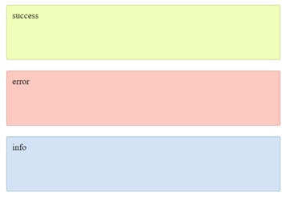

## Zadanie rozwiązywane z wykładowcą

> ### Przygotowanie
> Zmodyfikuj plik `package.json` tak, aby zmienna `source` wskazywała na:
> -  `03_Dzien_2/01_Dziedziczenie/01_Placeholdery`
>
> **Pamiętaj aby po każdej zmianie w pliku `package.json` przerwać działanie Parcel (`CTRL+C`) a następnie włączyć go z powrotem (`npm start`).**

### Zadanie 1

Znajdź w pliku `index.html` element `section` o klasie `test-mixin`. Ostyluj elementy wewnątrz zgodnie z opisem ich klas (obramowanie, lewa strona, )
Następnie stwórz za pomocą placeholdera sass - `%` regułę dla clearfix. Clearfx ma dodawać w odpowiednie miejsce pseudoelementy `::before` i `::after`.
Wykorzystaj dyrektywę `@extend` do rozszerzenia poszczególnych elementów o ten placeholder.

---

## Zadania do samodzielnego wykonania

### Zadanie 2

Znajdź w pliku `index.html` element `section` o klasie `container`.
Stwórz w niej trzy boksy reprezentujące: success, error i info.



Ostyluj je za pomocą Sass. Spróbuj wykorzystać w tym zadaniu **placeholder**, aby nie generować dodatkowej reguły w CSS. Niech Twój kod HTML wygląda w następująco:

```html
<div class="success">success</div>

<div class="error">error</div>

<div class="info">info</div>
```
