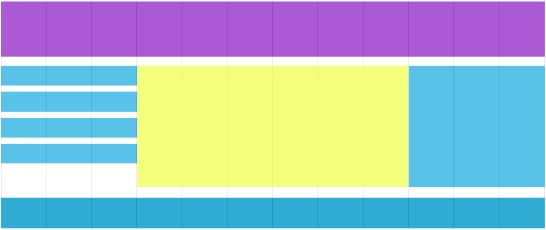

## Zadanie 1 - rozwiązywane z wykładowcą

> ### Przygotowanie
> Zmodyfikuj plik `package.json` tak, aby zmienna `source` wskazywała na:
> -  `05_Dzien_3/03_Grid/01_Zadanie_1`
>
> **Pamiętaj aby po każdej zmianie w pliku `package.json` przerwać działanie Parcel (`CTRL+C`) a następnie włączyć go z powrotem (`npm start`).**

Stwórz 12-kolumnowy grid za pomocą Sass. Odpowiednio zagnieźdź elementy tak, aby nie można było użyć kolumn bez wierszy ani bez głównego kontenera. Wykorzystaj grid do ustawienia obok siebie 3 elementów.

## Zadanie 2 

> ### Przygotowanie
> Zmodyfikuj plik `package.json` tak, aby zmienna `source` wskazywała na:
> -  `05_Dzien_3/03_Grid/02_Zadanie_2`
>
> **Pamiętaj aby po każdej zmianie w pliku `package.json` przerwać działanie Parcel (`CTRL+C`) a następnie włączyć go z powrotem (`npm start`).**

Przygotuj prostą stronę w oparciu o układ kolumnowy, odwzoruj poniższy obraz. Skorzystaj z grida, który stworzyliście wcześniej z wykładowcą.

