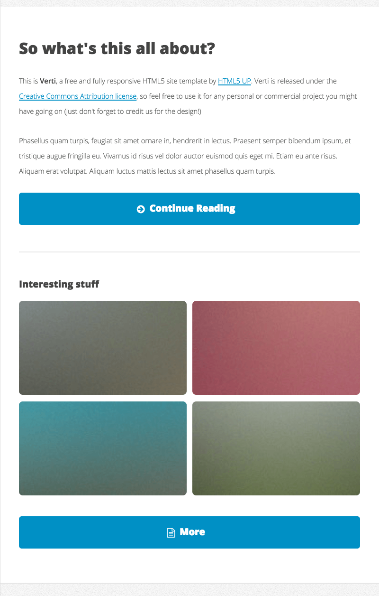
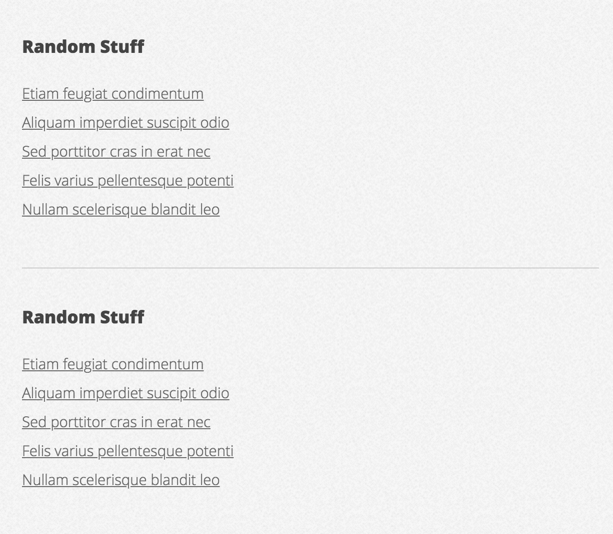
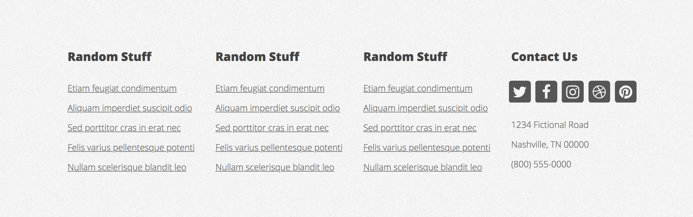

## Verti

Przed nami tworzenie strony internetowej. W pełni działającą stronę można zobaczyć na: [https://html5up.net/verti](https://html5up.net/verti).

> ### Przygotowanie
>
> Zmodyfikuj plik `package.json` tak, aby zmienna `source` wskazywała na:
>
> - `05_Dzien_3/04_Flexbox/01_Verti`
>
> **Pamiętaj aby po każdej zmianie w pliku `package.json` przerwać działanie Parcel (`CTRL+C`) a następnie włączyć go z powrotem (`npm start`).**

---

## Uwaga!

Zadanie jest na tyle rozbudowane, że na jego wykonanie potrzeba praktycznie całego dnia zajęć. Dlatego **jeżeli nie uda wam się go wykonać w dniu trzecim, należy skończyć cały projekt w dniu kolejnym!**

---

### Część 1 - Rozwiązywana z wykładowcą

Stwórz w pełni działający projekt, m.in:

- Stworzenie struktury folderów i plików
- Dodanie `reset.css`
- Podłączenie fontów, ikon itp.
- Uruchomienie projektu w parcel 

### Część 2 - Rozwiązywana z wykładowcą

Za pomocą flexboxa i wiedzy z tematu RWD stwórz poniższą sekcję. Należy tworzyć je w kolejności przedstawionej poniżej. Zaczynamy od widoku mobilnego.

Pomocne wskazówki:

- Użyty font - Open-Sans [https://fonts.google.com/specimen/Open+Sans](https://fonts.google.com/specimen/Open+Sans)
- Ikony pochodzą z Font Awesome (możesz użyć cdn: [https://cdnjs.com/libraries/font-awesome](https://cdnjs.com/libraries/font-awesome))
- Klasa ikony strzałki - `fas fa-arrow-circle-right`
- Klasa ikony znaku zapytania - `fas fa-question-circle`
- Tło strony - `#E4E4E4`
- Kolor tekstu - `#444444`
- Tło loga - `#FC4887` (jest to tekst w prostokącie)
- Niebieskie obramowanie przycisku - `#1691C3`
- Nawigacja powinna pojawiać się pod logiem **Verti** po naciśnięciu hamburger icon. **Nie należy korzystać z JavaScript!** Hamburger icon powinien być niestandardowym elementem `checkbox`. Przykład: [https://codepen.io/mutedblues/pen/MmPNPG](https://codepen.io/mutedblues/pen/MmPNPG).

#### Mobile

#### Tablet

#### Desktop

---

## Zadania do samodzielnego wykonania

### Część 1

Za pomocą **Grid** i wiedzy z tematu RWD stwórz poniższą sekcję:

Pomocne wskazówki:

- Zdjęcia znajdują się w folderze `assets`

#### Mobile

#### Tablet i Desktop

### Część 2

Za pomocą flexboxa lub grida i wiedzy z tematu RWD stwórz poniższą sekcję:

Pomocne wskazówki:

- Zdjęcia znajdują się w folderze `assets`
- Klasa ikony z dokumentem `fas fa-file-alt`

#### Mobile i Tablet

#### Desktop

### Część 3

Za pomocą flexboxa i wiedzy z tematu RWD stwórz poniższą sekcję:

Pomocne wskazówki:

- Klasa ikony Twitter - `fab fa-twitter`
- Klasa ikony Facebook - `fab fa-facebook`
- Klasa ikony Instagram - `fab fa-instagram`
- Klasa ikony Dribbble - `fa-dribbble`
- Klasa ikony Pinterest - `fab fa-pinterest`

#### Mobile

#### Tablet

#### Desktop

