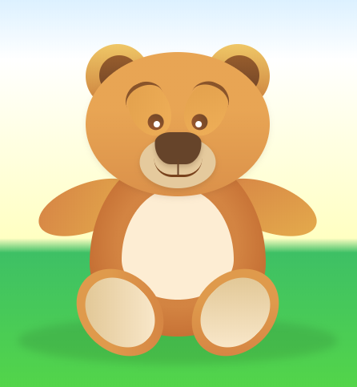
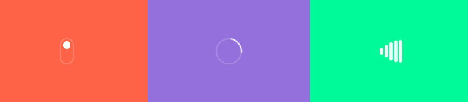

## Zadanie 1 - Niedźwiadek - Do rozwiązania z wykładowcą

> ### Przygotowanie
> Zmodyfikuj plik `package.json` tak, aby zmienna `source` wskazywała na:
> -  `07_Dzien_4/02_Animacje/01_Niedzwiadek`
>
> **Pamiętaj aby po każdej zmianie w pliku `package.json` przerwać działanie Parcel (`CTRL+C`) a następnie włączyć go z powrotem (`npm start`).**

Spróbuj poruszyć łapką lub okiem niedźwiedzia. Niedźwiedź jest zrobiony za pomocą elementów HTML.




## Zadania do samodzielnego wykonania

> ### Przygotowanie
> Zmodyfikuj plik `package.json` tak, aby zmienna `source` wskazywała na:
> -  `07_Dzien_4/02_Animacje/02_Zadania`
>
> **Pamiętaj aby po każdej zmianie w pliku `package.json` przerwać działanie Parcel (`CTRL+C`) a następnie włączyć go z powrotem (`npm start`).**


### Zadanie 1

Stwórzmy kilka animacji wczytywania, które przedstawia poniższy gif.



Do pierwszej animacji potrzebować będziemy 2 elementy - obramowanie i kulkę.

Do drugiej animacji wystarczy nam pojedynczy element, który będziemy obracać.

Trzecią animację zrobimy na 5 ułożonych obok siebie elementach.   
Wykorzystajmy tutaj opóźnienie animacji, które możemy zaaplikować n-tym elementom.   
Idealnym rozwiązaniem będzie tutaj wykorzystanie pętli w sass.


### Zadanie 2

W pliku index.html znajdziemy sekcję o klasie **.exercise2**.

Stwórzmy dowolne animacje, które pojawią się po najechaniu na przyciski.  
Pamiętajmy, że możecie korzystać z dowolnej właściwości np.  
`scale`, `box-shadow`, `text-shadow`, `border-radius`, `padding`, `background` itp.

Kilka przykładów możecie znaleźć na stronach:
 - [https://tympanus.net/Development/CreativeButtons/](https://tympanus.net/Development/CreativeButtons/ )
 - [https://tympanus.net/Development/ButtonStylesInspiration/](https://tympanus.net/Development/ButtonStylesInspiration/)
 
 
### Zadanie 3

Na stronie znajduje się przykładowa sekcja z portfolio zawierająca projekty.

Za pomocą CSS dodajmy ładne efekty po najechaniu na miniaturki.

Przykłady, na których możemy się wzorować: [https://tympanus.net/Development/HoverEffectIdeas/](https://tympanus.net/Development/HoverEffectIdeas/).

Przykładowym efektem może być:
- w stanie spoczynkowym (nie `hover`) tytuł i tekst jest niewidoczny (`opacity: 0;`)
- po najechaniu na element portfolio pokazujemy tytuł i tekst
- dodatkowo po najechaniu skalujemy i obracamy zdjęcie

## Animacja Zombie

> ### Przygotowanie
> Zmodyfikuj plik `package.json` tak, aby zmienna `source` wskazywała na:
> -  `07_Dzien_4/02_Animacje/03_Zombie`
>
> **Pamiętaj aby po każdej zmianie w pliku `package.json` przerwać działanie Parcel (`CTRL+C`) a następnie włączyć go z powrotem (`npm start`).**

Stwórz animację kroczącego zombie z wykorzystaniem CSS sprite.
Link do obrazka: http://www.wdrfree.com/public/demos/animatespritekeyframes/walkingdead.png

Podpowiedź: 
- wymiary jednej klatki animacji 200x312 pixeli, 
- ilość klatek: 10.

Tutorial w razie potrzeby: [http://blog.teamtreehouse.com/css-sprite-sheet-animations-steps](http://blog.teamtreehouse.com/css-sprite-sheet-animations-steps).


### Dodatkowe dla chętnych
Tak samo jak przy kilku innych właściwościach, tak i przy animacjach możemy do pojedynczego elementu dodać wiele animacji po przecinku np.
```
animation: myAnim1 3s 0s, myAnim2 5s 0s alternate;
```
Dodaj dla zombie dodatkową animację, która wykona się **jeden raz** i przesunie go z prawej strony ekranu na lewą (i pozostawi go po lewej stronie). Zastosuj tutaj odpowiednie właściwości dla animacji. Aby uzyskać takie przesunięcie zastosuj dla zombie pozycjonowanie absolutne tak jak na poniższej grafice. Element **.zombie** powinien znajdować się wewnątrz elementu **.board**. Po zakończonej animacji zombie powinien być niewidoczny po lewej stronie planszy.


## Animacja Rakiety

> ### Przygotowanie
> Zmodyfikuj plik `package.json` tak, aby zmienna `source` wskazywała na:
> -  `07_Dzien_4/02_Animacje/04_Rakieta`
>
> **Pamiętaj aby po każdej zmianie w pliku `package.json` przerwać działanie Parcel (`CTRL+C`) a następnie włączyć go z powrotem (`npm start`).**

Dzięki animacji CSS odwiedź rakietą wszystkie planety.
Wymagać to będzie obracania rakiety oraz przesuwania jej do odpowiednich pozycji.

Zrobienie długiej pojedynczej animacji może być tutaj problematyczne, ponieważ ciężko dobrać ile procent ma zająć dana faza ruchu oraz obrót i połączyć to wszystko w jeden długi lot. 

O wiele łatwiejszym rozwiązaniem będzie stworzenie 4 oddzielnych animacji które dodasz do rakiety (po przecinku, jak w poprzednim zadaniu). Każda taka animacja będzie odpowiadać za pojedynczy lot na kolejną planetę. 

Początek animacji to odpowiedni obrót - tak by rakieta nie latała tyłem (chociaż kto ich tam wie), po którym następuje przelot we współrzędne kolejnej planety.

Kolejne animacje powinny się zaczynać z odpowiednim opóźnieniem. Po zakończonym locie możesz sobie wystawić dyplom asa przestworzy.

